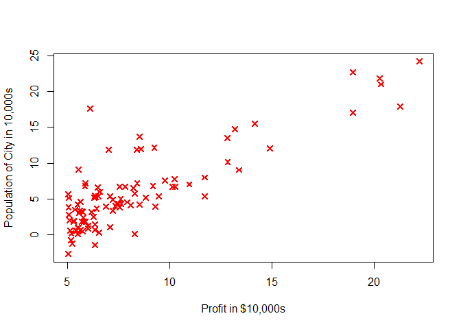
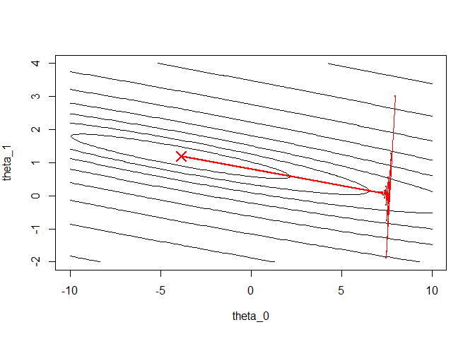

Linear Regression with R
================

One-variable linear regression
==============================

Part 1: Basic Function
----------------------

``` r
# warmUpExercise
warmUpExercise  <- function() {
  A <- diag(5) 
  A
}
cat('5x5 Identity Matrix: \n')
```

    ## 5x5 Identity Matrix:

``` r
warmUpExercise()
```

    ##      [,1] [,2] [,3] [,4] [,5]
    ## [1,]    1    0    0    0    0
    ## [2,]    0    1    0    0    0
    ## [3,]    0    0    1    0    0
    ## [4,]    0    0    0    1    0
    ## [5,]    0    0    0    0    1

Part 2: Plotting
----------------

``` r
plotData <- function (x, y) {
  plot(
    x, y, col = "red", pch = 4,cex = 1.1,lwd = 2,
    xlab = 'Profit in $10,000s',
    ylab = 'Population of City in 10,000s'
  )
}
```

``` r
cat('Plotting Data ...\n')
```

    ## Plotting Data ...

``` r
data <- read.table("ex1data1.txt",sep=',')
X <- data[, 1]
y <- data[, 2]
m <- length(y) # number of training examples

# Plot Data
# Note: You have to complete the code in plotData.R
plotData(X, y)
```



Part 3: Gradient descent
------------------------

``` r
computeCost  <- function(X, y, theta) {
  #   J <- COMPUTECOST(X, y, theta) computes the cost of using theta as the
  #   parameter for linear regression to fit the data points in X and y
  
  # Initialize some useful values
  m <- length(y) # number of training examples
  
  J <- 0
  dif <- X %*% theta - y
  J <- (t(dif) %*% dif) / (2 * m)
  J
}
```

``` r
gradientDescent <- function(X, y, theta, alpha, num_iters) {
  #GRADIENTDESCENT Performs gradient descent to learn theta
  #   theta <- GRADIENTDESENT(X, y, theta, alpha, num_iters) updates theta by
  #   taking num_iters gradient steps with learning rate alpha
  
  # Initialize some useful values
  m <- length(y) # number of training examples
  J_history = rep(0,num_iters + 1)
  theta_history = matrix(0,num_iters + 1,length(theta))
  
  theta_history[1,] = t(theta)
  J_history[1] = computeCost(X, y, theta)
  
  for (iter in 2:(num_iters + 1)) {

    # create a copy of theta for simultaneous update.
    theta_prev = theta
    
    # number of features.
    p = dim(X)[2]
    
    # simultaneous update theta using theta_prev.
    for (j in 1:p) {
      # vectorized version
      # (exactly the same with multivariate version)
      deriv = (t(X %*% theta_prev - y) %*% X[, j]) / m
      
      # update theta_j
      theta[j] = theta_prev[j] - (alpha * deriv)
    }
    
    # Save the cost J in every iteration
    J_history[iter] = computeCost(X, y, theta)
    theta_history[iter,] = t(theta)
  }
  
  list(theta = theta, J_history = J_history, theta_history = theta_history)
}
```

``` r
cat('Running Gradient Descent ...\n')
```

    ## Running Gradient Descent ...

``` r
X <- cbind(rep(1,m),X) # Add a column of ones to x
X <- as.matrix(X)
# initialize fitting parameters
theta <- c(8,3)

# Some gradient descent settings
iterations <- 1500
alpha <- 0.02

# compute and display initial cost
computeCost(X, y, theta)
```

    ##         [,1]
    ## [1,] 383.526

``` r
# run gradient descent
gd <- gradientDescent(X, y, theta, alpha, iterations)
#Decompose list (gd) variables into global env variables
theta <- gd$theta
J_history <- gd$J_history
theta_history <- gd$theta_history
rm(gd)

# print theta to screen
cat('Theta found by gradient descent: ')
```

    ## Theta found by gradient descent:

``` r
cat(sprintf('%f %f \n', theta[1], theta[2]))
```

    ## -3.844313 1.187863

``` r
# Plot the linear fit
# keep previous plot visible
plotData(X[, 2], y)
lines(X[, 2], X %*% theta, col="blue")
legend("bottomright", c('Training data', 'Linear regression'), pch=c(4,NA),col=c("red","blue"), lty=c(NA,1) )
```


``` r
# Predict values for population sizes of 35,000 and 70,000
predict1 <- c(1, 3.5) %*% theta
cat(sprintf('For population = 35,000, we predict a profit of %f\n',predict1*10000))
```

    ## For population = 35,000, we predict a profit of 3132.080736

``` r
predict2 <- c(1, 7) %*% theta
cat(sprintf('For population = 70,000, we predict a profit of %f\n',predict2*10000))
```

    ## For population = 70,000, we predict a profit of 44707.290050

Part 4: Visualizing J(theta\_0, theta\_1)
-----------------------------------------

``` r
cat('Visualizing J(theta_0, theta_1) ...\n')
```

    ## Visualizing J(theta_0, theta_1) ...

``` r
# Grid over which we will calculate J
theta0_vals <- seq(-10, 10, length.out=100)
theta1_vals <- seq(-2, 4, length.out=100)

# initialize J_vals to a matrix of 0's
J_vals <- matrix(0,length(theta0_vals), length(theta1_vals))

# Fill out J_vals
for (i in 1:length(theta0_vals)) {
    for (j in 1:length(theta1_vals)) {
      J_vals[i,j] <- computeCost(X, y, c(theta0_vals[i], theta1_vals[j]))
    }
}

#interactive 3D plot
#install.packages("rgl")
library(rgl) 
open3d()
```

    ## wgl 
    ##   1

``` r
nbcol = 100
color = rev(rainbow(nbcol, start = 0/6, end = 4/6))
J_vals_col  = cut(J_vals, nbcol)

persp3d(theta0_vals, theta1_vals, J_vals,col = color[J_vals_col],
        xlab=expression(theta_0),ylab=expression(theta_1),
        zlab="Cost",main = "Gradient Descent")
points3d(theta_history[, 1], theta_history[, 2], J_history+10, 
         col="red",size=3.5)
lines3d(theta_history[, 1], theta_history[, 2], J_history+10, col="red")

# Contour plot
# Plot J_vals as 20 contours spaced logarithmically between 0.01 and 100
# logarithmic contours are denser near the center
logspace <- function( d1, d2, n) 
            return(exp(log(10)*seq(d1, d2, length.out=n)))
            #or return(10^seq(d1, d2, length.out=n))

contour(theta0_vals, theta1_vals, J_vals, levels = logspace(-2, 3, 20), 
        xlab=expression(theta_0),
        ylab=expression(theta_1),
        drawlabels = FALSE)

points(theta[1], theta[2], pch=4, cex=2,col="red",lwd=2)
points(theta_history[, 1], theta_history[, 2], col="red",cex=.2,lwd=1,pch=19)
lines(theta_history[, 1], theta_history[, 2], col="red")
```



Multi-variables linear regression
=================================

Part 1: Feature Normalization
-----------------------------

``` r
## Load Data
data <- read.table('ex1data2.txt',sep = ',')
X <- data[,1:2]
y <- data[,3]
m <- length(y)

# Print out some data points
cat('First 10 examples from the dataset: \n')
```

    ## First 10 examples from the dataset:

``` r
temp <- cbind("X = [",X[1:10,], "], y =", y[1:10])
names(temp) <- NULL
print(temp)
```

    ##                              
    ## 1  X = [ 2104 3 ], y = 399900
    ## 2  X = [ 1600 3 ], y = 329900
    ## 3  X = [ 2400 3 ], y = 369000
    ## 4  X = [ 1416 2 ], y = 232000
    ## 5  X = [ 3000 4 ], y = 539900
    ## 6  X = [ 1985 4 ], y = 299900
    ## 7  X = [ 1534 3 ], y = 314900
    ## 8  X = [ 1427 3 ], y = 198999
    ## 9  X = [ 1380 3 ], y = 212000
    ## 10 X = [ 1494 3 ], y = 242500

``` r
featureNormalize <- function(X) {
  #FEATURENORMALIZE Normalizes the features in X
  #   FEATURENORMALIZE(X) returns a normalized version of X where
  #   the mean value of each feature is 0 and the standard deviation
  #   is 1. This is often a good preprocessing step to do when
  #   working with learning algorithms.

  X_norm <- X
  mu <- rep(0,dim(X)[2])
  sigma <- rep(0,dim(X)[2])

  # mu
  for (p in 1:dim(X)[2]) {
    mu[p] <- mean(X[,p])
  }
  
  # sigma
  for (p in 1:dim(X)[2]) {
    sigma[p] <- sd(X[,p])
  }
  
  # X_norm
  for (p in 1:dim(X)[2]) {
    if (sigma[p] != 0)
      for (i in 1:dim(X)[1])
        X_norm[i, p] <- (X[i, p] - mu[p]) / sigma[p]
      else
        # sigma(p) == 0 <=> forall i, j,  X(i, p) == X(j, p) == mu(p)
        # In this case,  normalized values are all zero.
        # (mean is 0,  standard deviation is sigma(=0))
        X_norm[, p] <- t(rep(0,dim(X)[1]))
  }
  
  list(X_norm = X_norm, mu = mu, sigma = sigma)
}
```

``` r
# Scale features and set them to zero mean
cat('Normalizing Features ...\n')
```

    ## Normalizing Features ...

``` r
fN <- featureNormalize(X)
X <- fN$X_norm
mu <- fN$mu
sigma <- fN$sigma

# Add intercept term to X
X <- cbind(rep(1,m),X)
X <- as.matrix(X)
```

Part 2: Gradient Descent
------------------------

``` r
computeCostMulti <- function(X, y, theta) {
  #COMPUTECOSTMULTI Compute cost for linear regression with multiple variables
  #   J <- COMPUTECOSTMULTI(X, y, theta) computes the cost of using theta as the
  #   parameter for linear regression to fit the data points in X and y
  
  # Initialize some useful values
  m <- length(y) # number of training examples
  
  J <- 0
  dif <- X %*% theta - y
  J <- (t(dif) %*% dif) / (2 * m)
  J
}
```

``` r
gradientDescentMulti <- function(X, y, theta, alpha, num_iters) {
  #GRADIENTDESCENTMULTI Performs gradient descent to learn theta
  #   theta <- GRADIENTDESCENTMULTI(x, y, theta, alpha, num_iters) updates theta by
  #   taking num_iters gradient steps with learning rate alpha
  
  # Initialize some useful values
  m <- length(y) # number of training examples
  J_history <- rep(0,num_iters)
  
  for (iter in 1:num_iters) {
    theta_prev <- theta
    
    # number of features.
    p <- dim(X)[2]
    
    for (j in 1:p) {
      # calculate dJ/d(theta_j)
      deriv <- (t(X %*% theta_prev - y) %*% X[,j]) / m
      
      # # update theta_j
      theta[j] <- theta_prev[j] - (alpha * deriv)
    }
    
    # Save the cost J in every iteration
    J_history[iter] <- computeCostMulti(X, y, theta)
    
  }
  list(theta = theta, J_history = J_history)
}
```

``` r
# Choose some alpha value
alpha <- 1 # modified from 0.01 because 3.2.1
num_iters <- 50 #modified from 100 because 3.2.1

# Init Theta and Run Gradient Descent
theta <- rep(0,3)
# Here we can test different learning parameter alpha
gDM <- gradientDescentMulti(X, y, theta, alpha , num_iters)
theta <- gDM$theta
J_history <- gDM$J_history
rm(gDM)

# Plot the convergence graph
plot(1:length(J_history), J_history, type="l", col="blue", lwd=2, cex=.1,
     xlab="Number of Iterations", ylab="Cost J")
```


``` r
# Display gradient descent's result
cat('Theta computed from gradient descent: \n')
```

    ## Theta computed from gradient descent:

``` r
print(theta)
```

    ## [1] 340412.660 110631.050  -6649.474

``` r
# Estimate the price of a 1650 sq-ft, 3 br house
# Recall that the first column of X is all-ones. Thus, it does
# not need to be normalized.

price <- cbind(1, (1650-mu[1])/sigma[1], (3-mu[2])/sigma[2]) %*% theta

cat(sprintf('Predicted price of a 1650 sq-ft, 3 br house (using gradient descent):\n $%f\n', price))
```

    ## Predicted price of a 1650 sq-ft, 3 br house (using gradient descent):
    ##  $293081.464335

``` r
# Plotting Training and regressioned data.
cat('Plotting Training and regressioned results by gradient descent.\n')
```

    ## Plotting Training and regressioned results by gradient descent.

``` r
X <- cbind(rep(1,m), data[, 1:2])
X <- as.matrix(X)
library(rgl)

open3d()
```

    ## wgl 
    ##   2

``` r
plot3d(X[,2],X[,3],y, 
       xlab= "sq-ft of room", ylab="#bedroom", zlab="price", col="blue",  
       type="s",size=1.5, main="Result of Gradient Descent")

xx <- seq(0,5000,length.out=25)
yy <- seq(1,5,length.out = 25)
zz <- matrix(0,length(xx),length(yy))

for (i in 1:length(xx))
  for (j in 1:length(yy))
    zz[i,j] <- cbind(1, (xx[i]-mu[1])/sigma[1],(yy[j]-mu[2])/sigma[2]) %*% theta

#MATLAB Like plane
nbcol = 100
color = rev(rainbow(nbcol, start = 0/6, end = 4/6))
zcol  = cut(zz, nbcol)

persp3d(xx,yy,zz, add = TRUE, col=color[zcol],alpha=.6)
```

Part 3: Normal Equations
------------------------

``` r
normalEqn <- function(X, y) {
  #NORMALEQN Computes the closed-form solution to linear regression
  #   NORMALEQN(X,y) computes the closed-form solution to linear
  #   regression using the normal equations.
  pinv <-
    function (X, tol = max(dim(X)) * max(X) * .Machine$double.eps)
    {
      if (length(dim(X)) > 2L || !(is.numeric(X) || is.complex(X)))
        stop("'X' must be a numeric or complex matrix")
      if (!is.matrix(X))
        X <- as.matrix(X)
      Xsvd <- svd(X)
      if (is.complex(X))
        Xsvd$u <- Conj(Xsvd$u)
      Positive <- any(Xsvd$d > max(tol * Xsvd$d[1L], 0))
      if (Positive)
        Xsvd$v %*% (1 / Xsvd$d * t(Xsvd$u))
      else
        array(0, dim(X)[2L:1L])
    }
  
  theta <- rep(0,length(y))
  theta <- pinv(t(X) %*% X) %*% t(X) %*% y
  theta
}
```

``` r
cat('Solving with normal equations...\n')
```

    ## Solving with normal equations...

``` r
## Load Data
data <- read.table('ex1data2.txt',sep =',')
X <- data[, 1:2]
y <- data[, 3]
m <- length(y)

# Add intercept term to X
X <- cbind(rep(1,m),X)
X <- as.matrix(X)
# Calculate the parameters from the normal equation
theta <- normalEqn(X, y)

# Display normal equation's result
cat('Theta computed from the normal equations: \n')
```

    ## Theta computed from the normal equations:

``` r
print(theta)
```

    ##            [,1]
    ## [1,] 89597.9095
    ## [2,]   139.2107
    ## [3,] -8738.0191

``` r
# Estimate the price of a 1650 sq-ft, 3 br house
price <- c(1, 1650, 3) %*% theta

cat(sprintf('Predicted price of a 1650 sq-ft, 3 br house (using normal equations):\n $%f\n', price))
```

    ## Predicted price of a 1650 sq-ft, 3 br house (using normal equations):
    ##  $293081.464335
