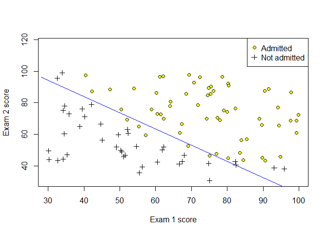
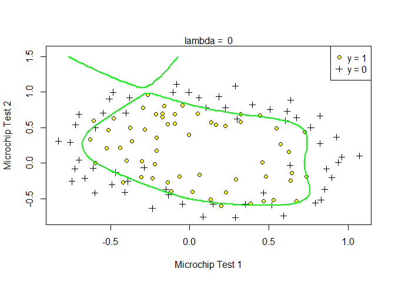

Logistic Regression with R
================

Logistic Regression
===================

Load Data
---------

``` r
data <- read.table('ex2data1.txt',sep = ',')
X <- data[,c(1,2)]; y <- data[,3]
X <- as.matrix(X)
```

Part 1: Plotting
----------------

``` r
plotData <-
  function (X, y, axLables = c("Exam 1 score","Exam 2 score"), legLabels =
              c('Admitted', 'Not admitted')) {
    #PLOTDATA Plots the data points X and y into a new device
    #   PLOTDATA(x,y) plots the data points with + for the positive examples
    #   and o for the negative examples. X is assumed to be a Mx2 matrix.

    symbolss <- c(3,21) #plus and empty circle character codes

    ############### This part is for legend to be plotted above the plot
    plot(X[,1],X[,2],type = "n", xaxt = "n", yaxt = "n")
    leg <- legend(
      "topright",legLabels, pch = rev(symbolss),
      pt.bg = "yellow", plot = FALSE
    )
    
    #custom ylim. Add the height of legend to upper bound of the range
    yrange <- range(X[,2])
    yrange[2] <- 1.04 * (yrange[2] + leg$rect$h)
    ###############

    yfac <- factor(y)
    plot(
      X[,1],X[,2], pch = symbolss[yfac] ,bg = "yellow", lwd = 1.3,
      xlab = axLables[1], ylab = axLables[2],
      ylim = yrange
    )
    
    legend("topright",legLabels,pch = rev(symbolss),
           pt.bg = "yellow")
}
```

``` r
cat(sprintf('Plotting data with + indicating (y = 1) examples and o indicating (y = 0) examples.\n'))
```

    ## Plotting data with + indicating (y = 1) examples and o indicating (y = 0) examples.

``` r
plotData(X, y)
```


Part 2: Compute Cost and Gradient
---------------------------------

``` r
costFunction  <- function(X, y) {
  #COSTFUNCTION Compute cost for logistic regression
  #   J <- COSTFUNCTION(theta, X, y) computes the cost of using theta as the
  #   parameter for logistic regression.
  
  function(theta) {
    # Initialize some useful values
    m <- length(y) # number of training examples
    
    J <- 0

    h <- sigmoid(X %*% theta)
    J <- (t(-y) %*% log(h) - t(1 - y) %*% log(1 - h)) / m
    J
  }
}

sigmoid <- function(z) {
  #SIGMOID Compute sigmoid functoon
  #   J <- SIGMOID(z) computes the sigmoid of z.
  
  z <- as.matrix(z)
  g <- matrix(0,dim(z)[1],dim(z)[2])

  g <- 1 / (1 + exp(-1 * z))
  g
}

grad <- function(X, y) {
  #COSTFUNCTION Compute gradient for logistic regression
    #   J <- COSTFUNCTION(theta, X, y) computes the gradient of the cost
    #   w.r.t. to the parameters.
  function(theta) {

    # You need to return the following variable correctly
    grad <- matrix(0,dim(as.matrix(theta)))
    m <- length(y)

    h <- sigmoid(X %*% theta)
    # calculate grads
    grad <- (t(X) %*% (h - y)) / m
    
    grad
  }
}
```

``` r
#  Setup the data matrix appropriately, and add ones for the intercept term
m <- dim(X)[1]
n <- dim(X)[2]

# Add intercept term to x and X_test
X <- cbind(rep(1,m),X)
# Initialize fitting parameters
initial_theta <- rep(0,n+1)

# Compute and display initial cost and gradient
cF <- costFunction(X, y)(initial_theta)
cost <- costFunction(X, y)(initial_theta)
grd <- grad(X,y)(initial_theta)

cat(sprintf('Cost at initial theta (zeros): %f\n', cost))
```

    ## Cost at initial theta (zeros): 0.693147

``` r
cat(sprintf('Gradient at initial theta (zeros): \n'))
```

    ## Gradient at initial theta (zeros):

``` r
cat(sprintf(' %f \n', grd))
```

    ##  -0.100000 
    ##   -12.009217 
    ##   -11.262842

Part 3: Optimizing using optim
------------------------------

``` r
optimRes <- optim(par = initial_theta, fn = costFunction(X,y), gr = grad(X,y), 
      method="BFGS", control = list(maxit = 400))
theta <- optimRes$par
cost <- optimRes$value

# Print theta to screen
cat(sprintf('Cost at theta found by optim: %f\n', cost))
```

    ## Cost at theta found by optim: 0.203498

``` r
cat(sprintf('theta: \n'))
```

    ## theta:

``` r
cat(sprintf(' %f \n', theta))
```

    ##  -25.088453 
    ##   0.205649 
    ##   0.200882

``` r
mapFeature <- function(X1, X2) {
  # MAPFEATURE Feature mapping function to polynomial features
  #
  #   MAPFEATURE(X1, X2) maps the two input features
  #   to quadratic features used in the regularization exercise.
  #
  #   Returns a new feature array with more features, comprising of
  #   X1, X2, X1^2, X2^2, X1*X2, X1*X2^2, etc..
  #
  #   Inputs X1, X2 must be the same size
  #
  
  degree <- 6
  
  out <- matrix(1,length(X1),1)
  
  for (i in 1:degree)
    for (j in 0:i)
      out <- cbind(out, (X1 ^ (i - j)) * (X2 ^ j))
  
  out
}

plotDecisionBoundary <-
  function (theta, X, y, axLables = c("Exam 1 score","Exam 2 score"), legLabels =
              c('Admitted', 'Not admitted')) {
    #   PLOTDECISIONBOUNDARY Plots the data points X and y into a new figure with
    #   the decision boundary defined by theta
    #   PLOTDECISIONBOUNDARY(theta, X,y) plots the data points with + for the
    #   positive examples and o for the negative examples. X is assumed to be
    #   a either
    #   1) Mx3 matrix, where the first column is an all-ones column for the
    #      intercept.
    #   2) MxN, N>3 matrix, where the first column is all-ones
    
    # Plot Data
    plotData(X[,2:3], y,axLables,legLabels)
    
    if (dim(X)[2] <= 3)
    {
      # Only need 2 points to define a line, so choose two end points
      plot_x <- cbind(min(X[,2] - 2), max(X[,2] + 2))
      # Calculate the decision boundary line
      plot_y <- -1 / theta[3] * (theta[2] * plot_x + theta[1])
      
      # Plot, and adjust axes for better viewing
      lines(plot_x, plot_y, col = "blue")
      
    }
    else
    {
      # Here is the grid range
      u <- seq(-1,1.5, length.out = 50)
      v <- seq(-1,1.5, length.out = 50)
      
      z <- matrix(0, length(u), length(v))
      # Evaluate z <- theta*x over the grid
      for (i in 1:length(u))
        for (j in 1:length(v))
          z[i,j] <- mapFeature(u[i], v[j]) %*% theta
      
      # Notice you need to specify the range [0, 0]
      contour(
        u, v, z, xlab = 'Microchip Test 1', ylab = 'Microchip Test 2',
        levels = 0, lwd = 2, add = TRUE, drawlabels = FALSE, col = "green"
      )
      mtext(paste("lambda = ",lambda), 3)
    }
  }

# Plot Boundary
plotDecisionBoundary(theta, X, y)
```



Part 4: Predict and Accuracies
------------------------------

``` r
predict <- function(theta, X) {
  #PREDICT Predict whether the label is 0 or 1 using learned logistic
  #regression parameters theta
  #   p <- PREDICT(theta, X) computes the predictions for X using a
  #   threshold at 0.5 (i.e., if sigmoid(theta'*x) >= 0.5, predict 1)
  
  m <- dim(X)[1] # Number of training examples
  p <- rep(0,m)
  p[sigmoid(X %*% theta) >= 0.5] <- 1
  p
  # ----------------------------------------------------
}
```

``` r
prob <- sigmoid(t(c(1,45,85)) %*% theta)
cat(sprintf('For a student with scores 45 and 85, we predict an admission probability of\n %f\n', prob))
```

    ## For a student with scores 45 and 85, we predict an admission probability of
    ##  0.775686

``` r
# Compute accuracy on our training set
p <- predict(theta, X)

cat(sprintf('Train Accuracy: %f\n', mean(p == y) * 100))
```

    ## Train Accuracy: 89.000000

Regularized Logistic Regression
===============================

Load and Plot Data
------------------

``` r
data <- read.table('ex2data2.txt', sep = ',')
X <- data[,c(1,2)]; y <- data[,3]
X <- as.matrix(X)

plotData(X, y,axLables = c('Microchip Test 1','Microchip Test 2'),
         legLabels = c("y = 1","y = 0"))
```

[](ex2_logistic_regression_files/figure-markdown_github/unnamed-chunk-9-2.png)

Regularized
-----------

``` r
# Add Polynomial Features

# Note that mapFeature also adds a column of ones for us, so the intercept
# term is handled
X <- mapFeature(X[,1], X[,2])

# Initialize fitting parameters
initial_theta <- rep(0,dim(X)[2])

# Set regularization parameter lambda to 1
lambda <- 1

costFunctionReg  <- function(X, y, lambda) {
  #COSTFUNCTIONREG Compute cost for logistic regression with regularization
  #   J <- COSTFUNCTIONREG(theta, X, y, lambda) computes the cost of using
  #   theta as the parameter for regularized logistic regression
  function(theta)  {
    # Initialize some useful values
    m <- length(y) # number of training examples
    
    J <- 0
    # calculate hypothesis function h(x)
    h <- sigmoid(X %*% theta)
    # excluded the first theta value
    theta1 <- c(0,theta[-1])
    p <- lambda * (t(theta1) %*% theta1) / (2 * m)
    J <- (t(-y) %*% log(h) - t(1 - y) %*% log(1 - h)) / m + p
    J
    # ----------------------------------------------------
  }
}

gradReg  <- function (X, y, lambda) {
  #COSTFUNCTIONREG Compute gradient for logistic regression with regularization
  #   J <- COSTFUNCTIONREG(theta, X, y, lambda) computes the
  #   gradient of the cost w.r.t. to the parameters.
  function(theta)  {
    # Initialize some useful values
    m <- length(y); # number of training examples
    
    # You need to return the following variables correctly
    grad <- rep(0,length(theta))
    
    # calculate hypothesis function
    h <- sigmoid(X %*% theta)
    # excluded the first theta value
    theta1 <- c(0,theta[-1])
    
    # calculate grads
    grad <- (t(X) %*% (h - y) + lambda * theta1) / m
    grad
    # ----------------------------------------------------
  }
}

# Compute and display initial cost and gradient for regularized logistic
# regression
cost <- costFunctionReg(X, y, lambda)(initial_theta)
grd <- gradReg(X,y, lambda)(initial_theta)
cat(sprintf('Cost at initial theta (zeros): %f\n', cost))
```

    ## Cost at initial theta (zeros): 0.693147

Part 2: Regularization and Accuracies
-------------------------------------

``` r
# Initialize fitting parameters
initial_theta <- rep(0,dim(X)[2])

# Set regularization parameter lambda to 1 (you should vary this)
lambda <- 0
#try with lambda in (1,0,100,155)
# Optimize
optimRes <- optim(par = initial_theta, 
                  fn = costFunctionReg(X,y,lambda), 
                  gr = gradReg(X,y,lambda), 
                  method="BFGS", 
                  control = list(maxit = 400))

theta <- optimRes$par
J <- optimRes$value

# Plot Boundary
plotDecisionBoundary(theta, X, y, axLables = c('Microchip Test 1','Microchip Test 2'),
                     legLabels = c("y = 1","y = 0"))
```



``` r
# Compute accuracy on our training set
p <- predict(theta, X)

cat(sprintf('Train Accuracy: %f\n', mean(p == y) * 100))
```

    ## Train Accuracy: 86.440678
